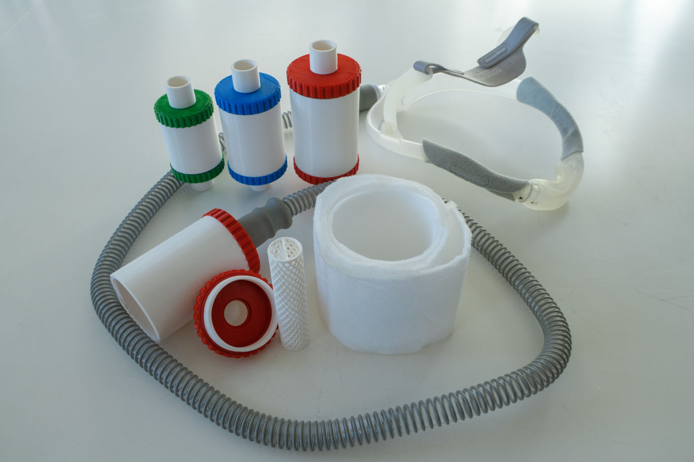

# The "Silent Night Customizable CPAP Muffler
This CPAP muffler/silencer can be used to dramatically reduce the noise travelling up the hose to the mask.

**NOTE:** This is compatible with standard rubber hose connectors (default 22mm, but it is customizable). If using the Resmed Airmini, or other travel CPAPs with non-standard hose connectors, an adapter will need to be used.



## Introduction
While using my travel CPAP (a Breas Z1 Auto) for treating my sleep apnea, the noise travelling up the hose have been bothering me. I have tested a couple of mufflers on the market, like the Breas Q-Tube and Breas Q-Lite, but have not been satisfied with the sound reduction, so I have been requiring ear-plugs. This design is fully customizable, but I have included 3 sizes which will be enough for most people, small (70mm long, small volume), medium (85mm, bigger volume) and large (100 mm, very big volume). I recommend the large variant for most people, but even the small design is quieter than the Breas Q-Tube/Q-Lite, so feel free to try them all out. Using these designs, I no longer have a need for ear plugs!

I designed this sound absorption muffler/silencer to be easy to print and assemble, and use common materials. The muffler consists of 3 printed parts: An outer cylinder body, end cap (female or male, depending on if you want the muffler attached directly on the CPAP), and inner mesh tube. There is also an optional gasket you can print in a flexible material like TPU, which can be used to improve the air-tight seal. An alternative if you don't have access to flexible material, is to use a gasket maker/sealant/silicone.

You will also need to add a sound absorbtion material sheet, like a sheet of fabric or ventilation filter. Also, if using the female end cap, you will also need to add a 22 x 2 mm O-ring (bought, or 3D-printed in TPU) to make it air-tight. 21 x 2 mm and 20 x 2 mm O-rings will also work, but may be a bit trickier to assemble.

## Assembly instructions:
After printing, make sure to test that the muffler is completely air-tight before final assembly. If using the female end cap, insert the 22 x 2 mm O-ring into the slot on the inside of the connector. Screw together body and end cap, cover one end and blow hard into the other, and ensure that no air escapes any gap. Submerge the muffler in water to figure out any holes/gaps.

1. Cut a sound absorption sheet (for instance ventilation filters bought in hardware stores) into a long strip, slightly less wide than the inner tube.
2. Roll up the sound absorption sheet around the inner tube, so it forms a thick padding around the tube.
3. Insert the tube and absorption material together into the cylinder body. If it is too large, cut and reduce the length of the sheet.
4. (Optionally) Insert the printed flexible gasket onto the end cap threading. An alternative is to use gasket maker/sealant/silicone.
5. Screw in the end-cap into the cylinder.

## Version history:

| Date | Description |
| ----------- | ----------- |
| 2024-10-07 | First version |
| 2026-02-05 | Added female end-cap |

## Model parameters:

### Large (the default):
```
Muffler_Length = 100;
Chamber_Thickness = 15;
End_Cap_Grip_Cutout_Diameter = 3;
```

### Medium:
```
Muffler_Length = 85;
Chamber_Thickness = 12;
End_Cap_Grip_Cutout_Diameter = 2.5;
```

### Small:
```
Muffler_Length = 70;
Chamber_Thickness = 9;
End_Cap_Grip_Cutout_Diameter = 2.5;
```
